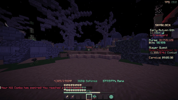
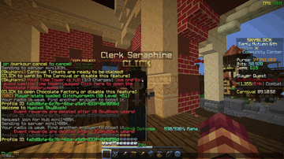

# CantStopWinning

[](https://www.minecraft.net/)
[](https://fabricmc.net/)
[](LICENSE)
[](https://github.com/Glitchyorsmth/CantStopWinning/releases)

I made this mod because I was mass grinding Diana and kept missing my own drops. I'd be zoned out auto-piloting burrows and not even notice when something good actually happened. So now when a drop hits, my entire screen explodes with falling money and slot machine sounds so there's zero chance I miss it again.

For the most dedicated SkyBlock gamblers who need the dopamine hit to match the grind.

A client-side Fabric mod that plays a fullscreen celebration (animated GIF + audio) when configurable chat messages appear. Set your triggers, keep grinding, and let the mod handle the hype.

<p>
 
</p>

---

## Features

### Celebration Overlay
- Fullscreen animated GIF overlay rendered on the HUD
- Audio clip synced with the overlay

### Chat Trigger System
- Configurable trigger messages — add as many as you want
- **Server-only filtering** — automatically ignores player chat so someone typing your trigger phrase won't set it off
- Works with Hypixel SkyBlock system messages, rank formats, and color codes
- Pre-loaded with `Wow! You dug out 1,000,000 coins!` by default

### Config GUI
- Clean in-game screen with bordered trigger list
- Add / remove triggers with one click
- Volume slider (0–100%)
- Paginated list — 12 triggers per page with `<` / `>` navigation

---

## Commands

| Command | Description |
|---|---|
| `/csw config` | Open the config GUI |
| `/csw test` | Fire the celebration immediately |
| `/csw on` | Enable the mod |
| `/csw off` | Disable the mod |
| `/csw help` | List all commands |

All commands are **client-side** with tab-completion.

---

## Installation

1. Download `cantstopwinning-1.0.0.jar` from [Releases](https://github.com/Glitchyorsmth/CantStopWinning/releases)
2. Drop it into your `.minecraft/mods/` folder
3. Launch the game — the default trigger is ready to go

---

## Customization

Want your own celebration? Just swap the files in your config folder — no rebuilding needed:

```
.minecraft/config/cantstopwinning/
├── cantstopwinning.json    ← config (edited in-game via /csw config)
├── celebration.gif         ← your animated GIF (transparent backgrounds work)
└── celebration.wav         ← your audio clip (WAV, PCM 16-bit)
```

The defaults are extracted there automatically on first launch. Replace `celebration.gif` or `celebration.wav` with your own and restart the game.

---

## License

This project is licensed under the [MIT License](LICENSE).
